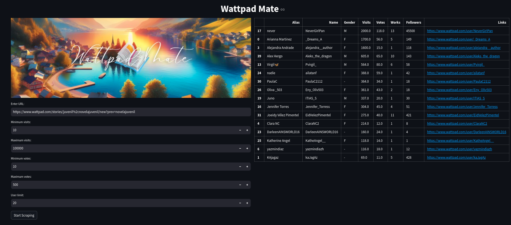

# **📚 Wattpad Mate**

  

Welcome to **Wattpad Mate**! This tool helps you connect with users who share similar interests on Wattpad.

## **📋 What is Wattpad Mate?**

Wattpad Mate is a handy Streamlit app that extracts data from Wattpad pages. It filters results based on visits and votes, then displays them in a Pandas data frame. You can view a list of top-voted users by category and interact with them directly through their profiles. Remember, this project is for educational purposes only and does not store any user data.

## **🕹️ Usage**

1. **Clone the Repository:** Start by cloning this repository. Make sure you have Docker installed on your machine to deploy this project.

2. **Set Up with Docker:** After cloning, launch the Docker Compose file with the command `docker compose up`. Docker will automatically set up the container and install all necessary libraries.

3. **Access the App:** Once the program is running, check your IP address. The service will be available on port 8501. Go to the app's web interface and enter the URL of the Wattpad page you want to scrape. Set your filters for minimum and maximum views and votes.

4. **Start Scraping:** Click the "Start Scraping" button to begin. The app will process the data and show you the results in a Pandas data frame.

## **🔧 Technologies**

- **Streamlit:** For creating and deploying the web app.
- **Docker:** To containerize the project.
- **Poetry:** For managing project dependencies.
- **Black:** To automatically format and clean up Python code.
- **Pandas & NumPy:** For ETL (Extract, Transform, Load) processes of Wattpad data.
- **BeautifulSoup & Selenium:** For scraping data from Wattpad, as there is no API available.
- **Loguru:** For logging and managing application logs.

## **⚠️ Note**

This app is meant for educational use only. It does not store user data and should not be used to scrape data from Wattpad without their explicit permission. Please respect Wattpad’s terms of service and use this tool responsibly. We disclaim any responsibility for misuse or unauthorized data scraping.

Enjoy exploring Wattpad and connecting with like-minded users!